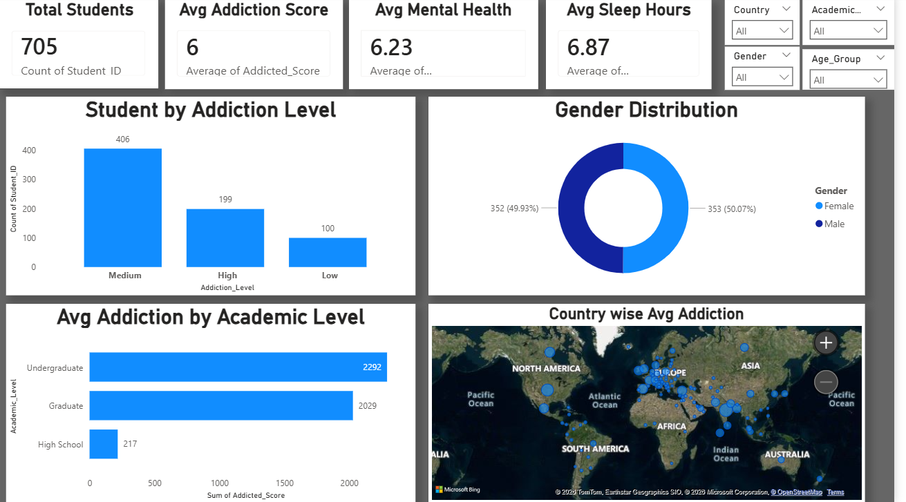
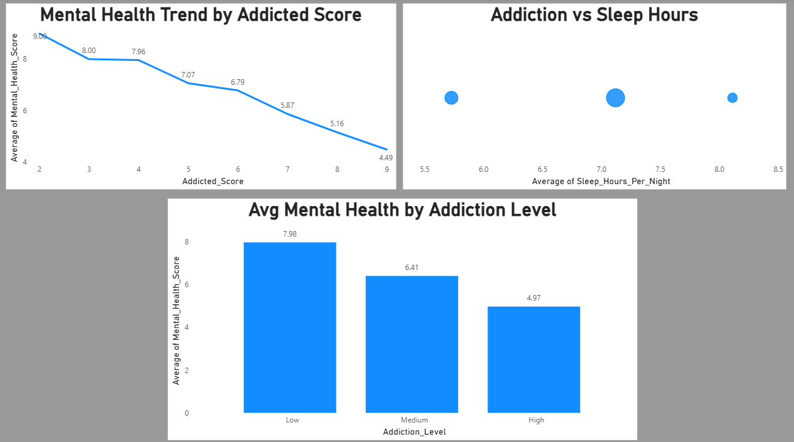

# Social Media Addiction Dashboard (Power BI)

##  Project Overview
This is an interactive Power BI dashboard analyzing social media addiction among students and its impact on mental health, sleep patterns, and lifestyle.

##  Objectives
- Identify addiction levels in students  
- Explore effect of addiction on mental health  
- Study sleep hours in relation to addiction  
- Compare demographics (age, gender, academic level, country)

---

##  Tools & Technologies
- Microsoft Power BI  
- Power Query  
- Microsoft Excel

---

##  Dataset Description

| Column | Meaning |
|--------|---------|
| Student_ID | Unique student |
| Age | Student age |
| Gender | Male / Female |
| Academic_Level | Class / degree level |
| Country | Student country |
| Sleep_Hours_Per_Night | Hours slept per night |
| Mental_Health_Score | Mental health rating |
| Relationship_Status | Relationship status |
| Conflicts_Over_Social_Media | Number of conflicts |
| Addicted_Score | Addiction score |

---

##  Dashboard Pages

###  1. Overview
- Total Students  
- Avg Addiction Score  
- Avg Mental Health  
- Avg Sleep Hours  
- Addiction Level Distribution  
- Gender Breakdown  
- Country-wise Analysis

###  2. Mental Health Impact
- Addiction vs Mental Health Line  
- Addiction vs Sleep Hours Scatter  
- Avg Mental Health by Addiction Level

###  3. Lifestyle & Conflicts
- Addiction Level vs Social Media Conflicts  
- Avg Addiction by Age Group  
- Relationship Status Distribution

---

## Dashboard Preview

### Overview

### Mental Health Impact

### Lifestyle & Conflicts

---

## Project Files

**Download / View:**  
- **Power BI File:** `Social_Media_Addiction_Dashboard.pbix`  
-  **Exported Report (PDF):** `Social_Media_Addiction_Dashboard.pdf`  
-  **Dataset (Excel):** `Students Social Media Addiction.xlsx`

---

## Key Insights
- Higher addiction → lower mental health  
- Students with higher addiction sleep less  
- Teens and undergraduate students show high addiction  
- More addiction linked to social media conflicts

---

##  Author
Yash Pandey
